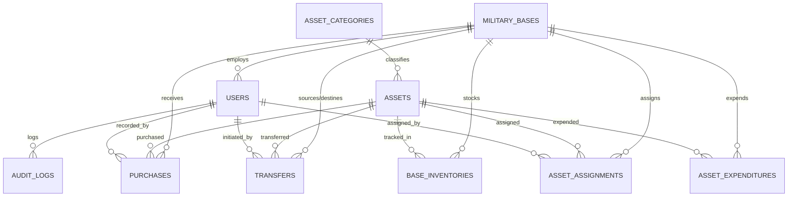

# Military Asset Management System (MAMS)

A full-stack enterprise defense logistics and inventory tracking system built with **Spring Boot 3 (Java 21)**, **React 18 + Vite**, **Spring Security (JWT & RBAC)**, and **MySQL 8.0**.

---

## Architecture & System Overview

MAMS provides real-time visibility into defense assets across multiple strategic military bases. The system manages the entire asset lifecycle: procurement, inter-base dispatches, active personnel deployments, field expenditures, and immutable security audit logs.

```
+-------------------------------------------------------------------------+
|                        React 18 Single-Page Client                      |
|      (Chakra Petch / Inter Design System, Axios Interceptors, JWT)      |
+------------------------------------+------------------------------------+
                                     |
                             REST API Calls (JSON)
                                     |
+------------------------------------+------------------------------------+
|                      Spring Boot 3 Application Layer                    |
|                                                                         |
|  [Security Filter Chain]  -->  [JWT Auth & RBAC]  -->  [Exception Handler]
|                                                                         |
|  [Controllers]                                                          |
|   ├── DashboardController        ├── TransferController                 |
|   ├── PurchaseController         ├── AssignmentController               |
|   ├── InventoryController        ├── ExpenditureController              |
|   └── AuthController             └── AuditLogController                 |
|                                                                         |
|  [Service Layer with ACID Transaction Boundaries]                       |
|   └── Business logic, stock validation, formulas, audit event publishing|
|                                                                         |
|  [Spring Data JPA Repositories / Hibernate 6]                           |
+------------------------------------+------------------------------------+
                                     |
                              JDBC Connection
                                     |
+------------------------------------+------------------------------------+
|                         MySQL 8.0 Database                              |
|   (Relational schema, foreign keys, composite indexes, audit records)   |
+-------------------------------------------------------------------------+
```

---

## Core Capabilities

### 1. Real-Time Operational Dashboard
- **Key Formulas & Metrics**:
  - **Opening Balance**: Stock on hand at the beginning of the selected period.
  - **Net Movement**: `Purchases + Transfers In - Transfers Out`
  - **Closing Balance**: `Opening Balance + Net Movement - Expended Assets`
  - **Assigned to Troops**: Equipment currently checked out to deployed soldiers.
  - **Expended Munitions**: Consumables expended during combat drills or missions.
- **Net Movement Drilldown Modal**: Interactive drilldown allowing officers to audit underlying purchase orders, incoming transfers, and outgoing shipments.
- **Visual Analytics**: Interactive category breakdown charts and multi-base asset distribution visualizations.

### 2. Procurements & Purchases
- Record purchase orders (`PO-YYYY-MIL-XXXX`) with supplier information, unit price, and quantities.
- Automatic inventory replenishment at destination bases upon transaction confirmation.
- Filter, search, and export purchase registries to CSV/PDF.

### 3. Inter-Base Transfers
- Transfer equipment between military installations (e.g., Fort Liberty to Camp Pendleton).
- Automated stock sufficiency validation at source base prior to dispatch to prevent negative balances.
- Real-time stock decrement at source and stock increment at destination base within atomic transactions.

### 4. Personnel Assignments & Expenditures
- **Field Deployments**: Issue tactical gear to personnel by service ID, rank, and squadron.
- **Return Lifecycle**: Log return conditions (`EXCELLENT`, `GOOD`, `NEEDS_MAINTENANCE`, `DAMAGED`) and return assets to available inventory.
- **Munitions Expenditures**: Record spent ammunition, rockets, and fuel with commanding officer authorizations.

### 5. Role-Based Access Control (RBAC)
- `ADMIN`: Unrestricted administrative clearance across all bases, users, ledgers, and security logs.
- `BASE_COMMANDER`: Operational oversight scoped to their assigned military base.
- `LOGISTICS_OFFICER`: Focused workflow for processing purchases, dispatching transfers, and managing stock ledger entries.

### 6. Tamper-Proof Audit Logging
- Every state mutation (purchases, transfers, assignments, returns, expenditures, logins) publishes an immutable event to the `audit_logs` table capturing timestamps, actor IDs, IP addresses, action types, and JSON payloads.

---

## Database Design



---

## Mathematical Formulation

$$\text{Net Movement} = \text{Purchases} + \text{Transfers In} - \text{Transfers Out}$$

$$\text{Closing Balance} = \text{Opening Balance} + \text{Net Movement} - \text{Expended Assets}$$

$$\text{Available Stock} = \max(0, \text{Closing Balance} - \text{Assigned to Troops})$$

---

## Default Accounts

All default accounts are initialized with password: `password123`

| Username | Role | Base | Assigned Officer |
| :--- | :--- | :--- | :--- |
| `admin` | `ADMIN` | Central HQ (All Bases) | Gen. Alexander Hayes (4-Star General) |
| `commander_liberty` | `BASE_COMMANDER` | Fort Liberty Command | Gen. Marcus Vance (Lt. General) |
| `commander_pendleton` | `BASE_COMMANDER` | Camp Pendleton Marine Base | Col. Sarah Jenkins (Colonel) |
| `logistics_liberty` | `LOGISTICS_OFFICER` | Fort Liberty Command | Maj. Robert Evans (Major) |
| `logistics_pendleton` | `LOGISTICS_OFFICER` | Camp Pendleton Marine Base | Capt. Emily Rodriguez (Captain) |

---

## Local Setup & Development

### Requirements
- Java 21 LTS
- Node.js 18+ and npm
- MySQL 8.0+

### 1. Database Initialization
```bash
mysql -u root -p military_asset_db < database/schema_and_data.sql
```

### 2. Backend Service (Port 8081)
```bash
cd backend
./mvnw spring-boot:run
```
*API Base URL: `http://localhost:8081/api`*

### 3. Frontend Web Client (Port 5173)
```bash
cd frontend
npm install
npm run dev
```
*Web Application: `http://localhost:5173`*

### Quick Start (Windows)
```powershell
.\start.ps1
# or
.\start.bat
```

---

## Integration Test Suite

Run the end-to-end API test suite:
```bash
node test-all-mams.mjs
```

### Test Coverage (35 / 35 Tests Passing):
1. **System Health**: Verifies API availability and operational status.
2. **RBAC Authentication**: Validates JWT token generation, role claims, and user registration.
3. **Ledger Invariants**: Asserts mathematical consistency between opening, net movement, expenditures, and closing balances.
4. **Net Movement Drilldown**: Audits purchases, inbound transfers, and outbound transfers.
5. **Procurement Workflow**: Creates POs and verifies base stock balance increments.
6. **Inter-Base Transfers**: Dispatches assets and synchronizes source/destination ledgers.
7. **Troop Lifecycle**: Tests assignment checkout, condition assessment, and asset check-in.
8. **Munitions Expenditure**: Verifies live munitions drawdown against closing balances.
9. **Stock Ledger Integrity**: Asserts category and base breakdowns match database state.
10. **Audit Trail Immutability**: Confirms event records are persisted with full actor telemetry.
